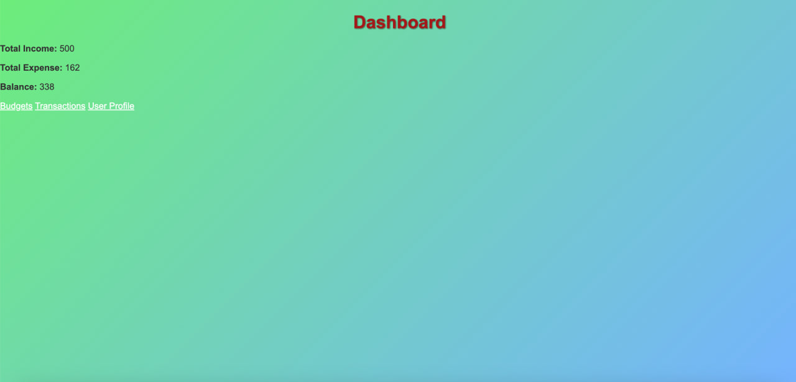
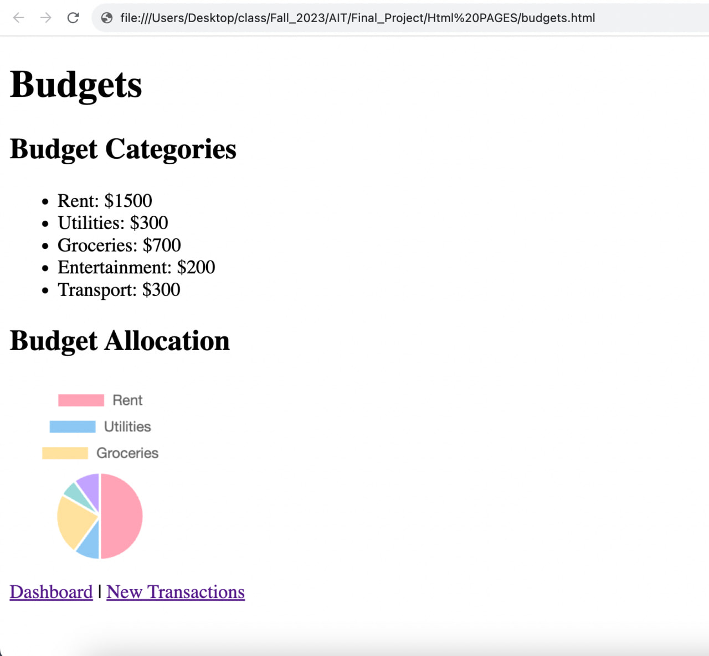
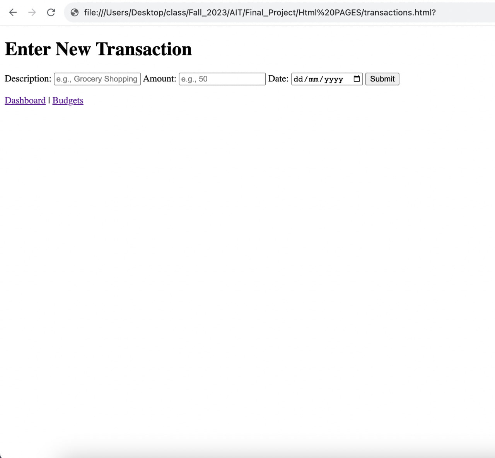
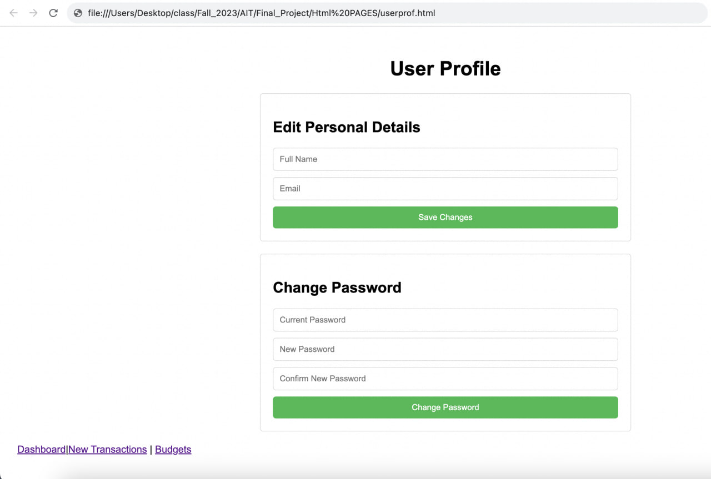
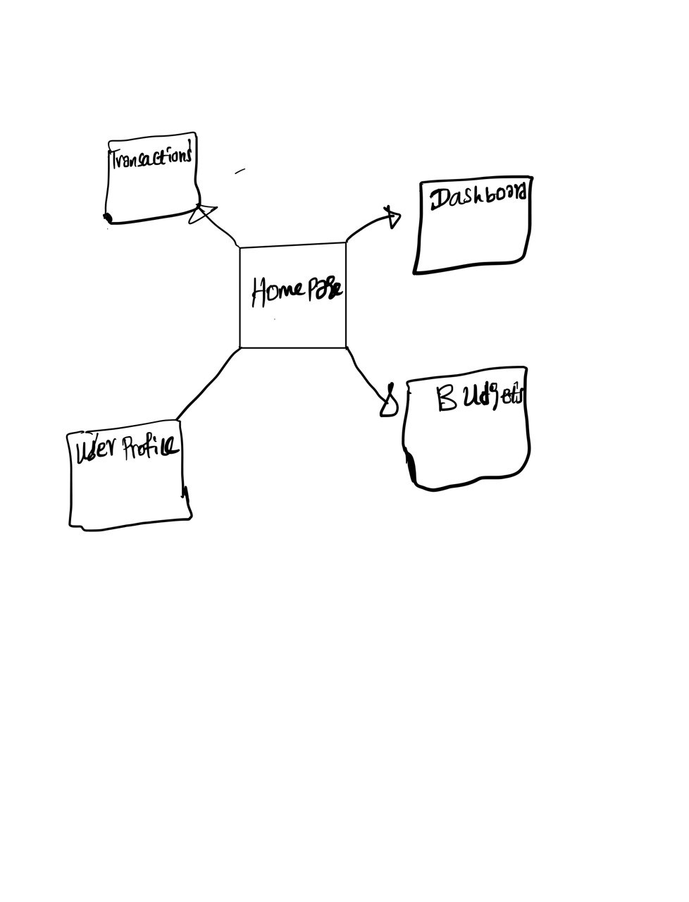

The content below is an example project proposal / requirements document. Replace the text below the lines marked "__TODO__" with details specific to your project. Remove the "TODO" lines.


# Personal Budget Tracker 

## Overview

Managing personal finances can often seem like an overwhelming task. Whether it's saving for future goals or tracking daily expenses, keeping a detailed record is essential. "Personal Budget Tracker" is designed to simplify this process. This web app provides a user-friendly interface for individuals to manage their income and expenses, view financial summaries, and set budgets for different categories, ensuring they are always informed about their financial health.

## Data Model

The application will primarily store Users, Budgets, and Transactions:

* Users can have multiple budgets (via references).
* Each budget can have multiple transactions (by embedding).


An Example User:

```javascript
{
  username: "johnDoe",
  password: // a password hash,
  email: "johndoe@email.com",
  budgets: // an array of references to Budget documents
}

```

Example Budget with Embedded Transactions:

```javascript
{
  user: // a reference to a User object,
  category: "Food and Dining",
  allocatedAmount: 500, // in dollars,
  transactions: [
    { description: "Dinner at ABC Restaurant", amount: 50, date: "YYYY-MM-DD", type: "expense"},
    { description: "Salary", amount: 1500, date: "YYYY-MM-DD", type: "income"},
  ]
}
```


## [Link to Commented First Draft Schema](db.mjs) 

- [Database Schemas (db.mjs)](/db.mjs)
   - This file contains the mongoose schemas used in the application.

## Wireframes

`/dashboard` - Main dashboard overview.


`/budgets` - Page displaying all user budgets.


`/transactions` - Page for adding new transactions.


`/userprof` - Page for managing user profile.


## Site map

`/map` - Site map.


## User Stories or Use Cases

1. As a non-registered user, I can register a new account with the site.
3. As a user, I can set budgets for various categories like Food, Entertainment, and Utilities.
2. As a user, I can log in to access my financial dashboard.
4. As a user, I can add income and expense transactions.
5. As a user, I can view a summary of my financial health, including total income, expenses, and balance.
6. As a user, I can view graphical representations of my income and expense trends.
7. As a user, I can change my personal details and password

## Research Topics

* (6 points) Vue.js as the front-end framework
- What is it?: Vue.js is a progressive JavaScript framework used to create interactive user interfaces.
- Why use it?: It is user-friendly, integrates well with other libraries and projects, and has a supportive community. Its simplicity does not sacrifice power, making it a versatile choice for many projects.
* (2 point) dotenv for Environment Variable Management

- What is it?: dotenv is a zero-dependency module that loads environment variables from a .env file into process.env. This module ensures that sensitive information, like API keys and database passwords, is kept separate from the codebase.

- Why use it?: It provides a secure and manageable way to store configuration settings and sensitive data, ensuring they are not hard-coded within the application's source code. This approach enhances security and simplifies configuration management across different development environments.
* (2 points) bcrypt for Secure Password Management

- What is it?: bcrypt is a robust password hashing function that builds upon the Blowfish cipher, including salt and adaptive processing.

- Why use it?: It securely stores passwords with strong hashing and built-in salting, helping prevent brute-force attacks and ensuring long-term security as computational power increases.

## [Link to Initial Main Project File](app.mjs) 

- [Application Entry Point (app.mjs)](/app.mjs)
   - This file is the main entry point of the application, where the express application is configured and run.

## Annotations / References Used

