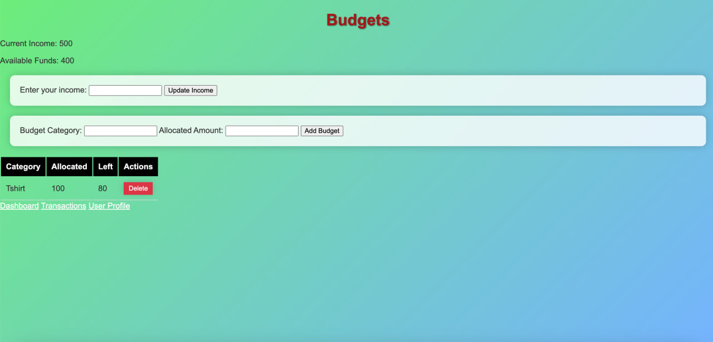

The content below is an example project proposal / requirements document. Replace the text below the lines marked "__TODO__" with details specific to your project. Remove the "TODO" lines.


# Personal Budget Tracker 

## Overview

Managing personal finances can often seem like an overwhelming task. Whether it's saving for future goals or tracking daily expenses, keeping a detailed record is essential. "Personal Budget Tracker" is designed to simplify this process. This web app provides a user-friendly interface for individuals to manage their income and expenses, view financial summaries, and set budgets for different categories, ensuring they are always informed about their financial health.

## Data Model

The application will primarily store Users, Budgets, and Transactions:

* Users can have multiple budgets (via references).
* Each budget can have multiple transactions (by embedding).


An Example User:

```javascript
{
  username: "johnDoe",
  password: // a password hash,
  email: "johndoe@email.com",
  budgets: // an array of references to Budget documents
}

```

Example Budget with Embedded Transactions:

```javascript
{
  user: // a reference to a User object,
  category: "Food and Dining",
  allocatedAmount: 500, // in dollars,
  transactions: [
    { description: "Dinner at ABC Restaurant", amount: 50, date: "YYYY-MM-DD", type: "expense"},
    { description: "Salary", amount: 1500, date: "YYYY-MM-DD", type: "income"},
  ]
}
```


## [Link to Commented First Draft Schema](db.mjs) 

- [Database Schemas (db.mjs)](/db.mjs)
   - This file contains the mongoose schemas used in the application.

## Wireframes

`/dashboard` - Main dashboard overview.


`/budgets` - Page displaying all user budgets.


`/transactions` - Page for adding new transactions.


`/userprof` - Page for managing user profile.


## Site map

`/map` - Page for managing transactions.


## User Stories or Use Cases

1. As a non-registered user, I can register a new account with the site.
2. As a user, I can log in to access my financial dashboard.
3. As a user, I can set budgets for various categories like Food, Entertainment, and Utilities.
4. As a user, I can add income and expense transactions.
5. As a user, I can view a summary of my financial health, including total income, expenses, and balance.
6. As a user, I can view graphical representations of my income and expense trends.
7. As a user, I can change my personal details and password

## Research Topics

* (5 points) Integrate user authentication using JWT (JSON Web Tokens).
* (4 points) Client-side form validation(express-validator) to ensure correct data entry by users.
* (3 points) Use of a charting library, such as Chart.js, to visually represent financial data.
12 points total out of 8 required points

## [Link to Initial Main Project File](app.mjs) 

- [Application Entry Point (app.mjs)](/app.mjs)
   - This file is the main entry point of the application, where the express application is configured and run.

## Annotations / References Used

(__TODO__: list any tutorials/references/etc. that you've based your code off of)

1. [passport.js authentication docs](http://passportjs.org/docs) - (add link to source code that was based on this)
2. [tutorial on vue.js](https://vuejs.org/v2/guide/) - (add link to source code that was based on this)

